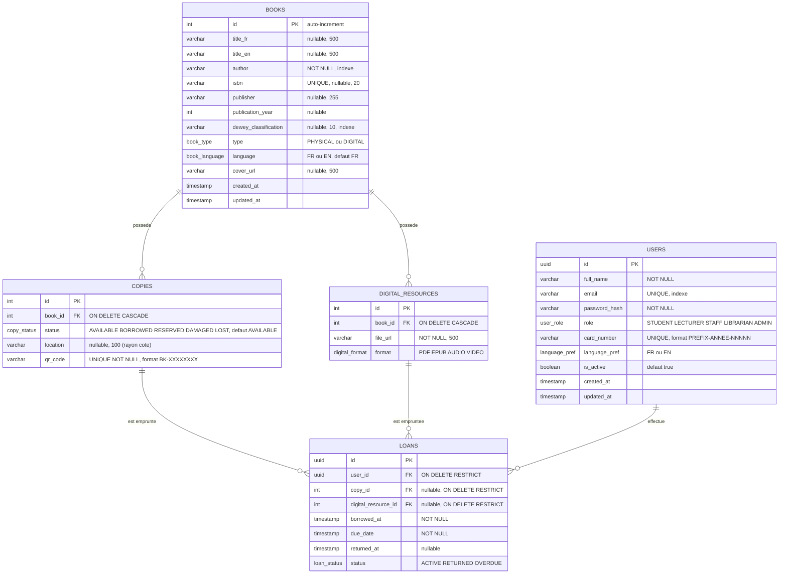

# Diagramme Entité-Association — Gestion du catalogue SmartLib

> Source de vérité : modèles SQLAlchemy (`app/models/`) + migrations Alembic.
> SGBD : PostgreSQL 16. Rendu : [mermaid.live](https://mermaid.live) ou aperçu Markdown GitHub/GitLab.

## Contraintes et règles de gestion

| Règle | Détail |
|---|---|
| CK `ck_loan_exactly_one_target` | Un prêt cible **exactement un** exemplaire **ou** une ressource numérique (jamais les deux, jamais aucun) |
| Suppression en cascade | Supprimer un `book` supprime ses `copies` et `digital_resources` |
| Card number | Généré par rôle : `ETU-2026-00451`, préfixes ETU/ENS/PER/BIB/ADM |
| QR code exemplaire | Identifiant opaque `BK-XXXXXXXX` collé physiquement sur chaque copie |
| Catégorisation | Pas de table Catégorie/Auteur/Éditeur : colonnes texte sur `books` + classification Dewey |
| Horodatage | Toutes les tables portent `created_at` / `updated_at` (TimestampMixin) |
